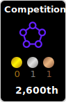
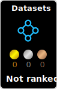
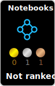
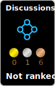

# Hi there!

My name is **Shunsuke Kikuchi**! I'm a second-year transfer student at **UCLA**, pursuing a double major in **Computational & Systems Biology**, with a track of Dynamical Modeling, and **Applied Mathematics**. 
I'm currently working in [Dr. Xia Yang's Lab](https://yanglab.ibp.ucla.edu/) on a project involving a machine learning model for predicting Gene Regulatory Networks (GRNs). 
Besides the lab project, I enjoy participating in **Kaggle** competitions! I make my rule to take part in at least one AI competition at a time, including other competition platforms or conference challenges.
 
 
**Interests** : Bioinformatics🧬, Computational Medicine📊, Network Science🌐 
**Hobby** : Running🏃, Manga/Anime📚 (fav: Girls' Last Tour) 
**Food** : Ramen🍜, Eel🐟, Taco🌮 
**Cats** : 2 Pets🐈 

 ### Kaggle status
<!-- HTML -->
|  |  |  |  |

### Current Projects
#### Research: 
- [scGRNdb](https://github.com/XiaYangLabOrg/scNetworkAtlas.git): scGRNdb is an analysis pipeline for single-cell and spatial-transcriptomics data via GRNs. It will be an interactive web server, coming soon!
#### AI competitions
- [CMI24](https://www.kaggle.com/competitions/child-mind-institute-problematic-internet-use): Challenge to analyze children's physical activity data to detect early indicators of problematic internet and technology use. This long-term project ends at the end of the year.
- [JSCAS](https://github.com/modafone/jscasaichallenge2024): The Japan Society for Computer Assisted Surgery (JSCAS) holds a challenge session. This year, we are solving three tasks involving videos from IMA (Internal Mammary Artery) bypass surgical operations.
- 
### Past Projects (24')
#### Research
- [SCING](https://github.com/XiaYangLabOrg/SCING): SCING is a machine-learning model predicting GRNs from single-cell and spatial transcriptomics data. I contributed to the validation of the model and customization of the community detection algorithm for our GRNs.

#### AI comeptitions
- MICCAI Endovis Challenge: Final result will be come out Oct. 10 at MICCAI Challenge Day. Hope see you there!
    - [SegCol](https://github.com/JmeesInc/SegColChallenge.git): Competing in semantic segmentation for tools and fold edges in colonoscopy videos, and applying active learning on the baseline model provided by the organizers.
    - [OSS](https://github.com/JmeesInc/OpenSuturingSkillsChallenge.git): Evaluating models for open suturing skills in student training videos.
    - [STIR](https://github.com/JmeesInc/STIR-Challenge.git): Deformable point tracking on the STIR Dataset videos, including 2D and stereo 3D tracking.
- [Leash-Bio BELKA](https://www.kaggle.com/competitions/leash-BELKA): Binding prediction of organic molecules to three proteins: BRD4, HSA, and sEH. Our team received a silver prize, achieving robust performance on both public (8/1950) and private (27/1950) datasets. See our [solution report](https://www.kaggle.com/competitions/leash-BELKA/discussion/519191)
- [HMS](https://www.kaggle.com/competitions/hms-harmful-brain-activity-classification): Detection for dangerous brain wave patterns using EEG data. My first medal on kaggle, (245/2767).
- [6th National Medical Ai Contest in Japan](https://www.kaggle.com/competitions/medical-ai-contest2024/overview): Segmentation on a large organ segmentation dataset, Totalsegmentator. got 4th prize ($100).
